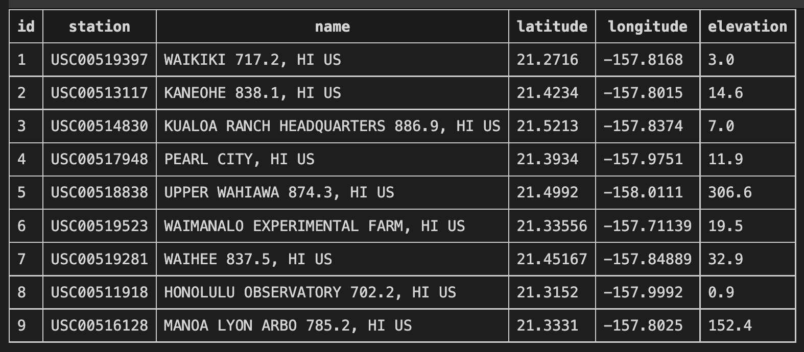
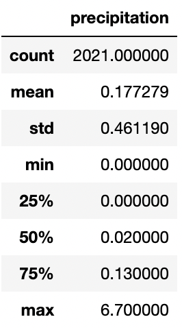
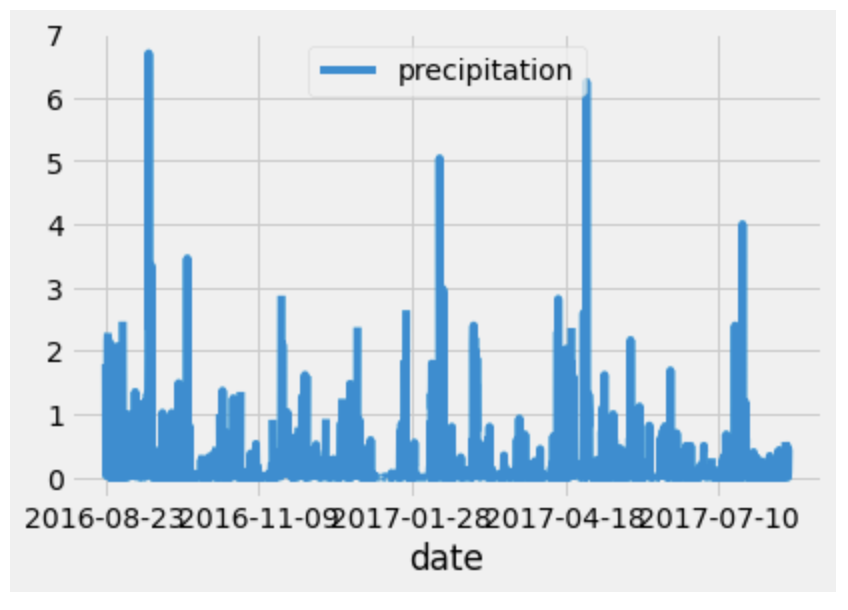
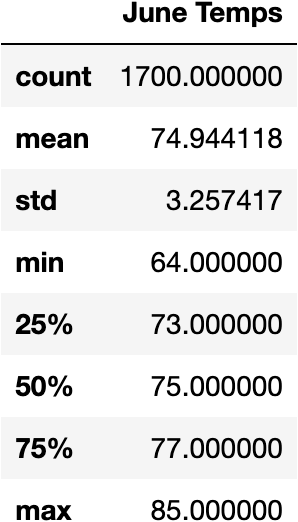
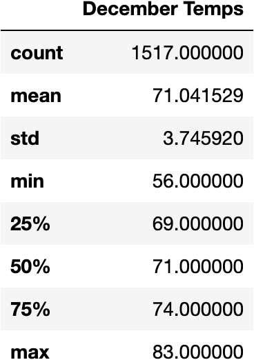
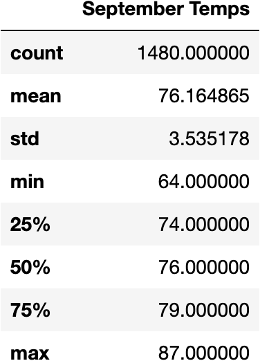
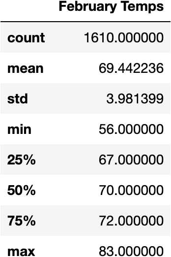

# surfs_up
## Overview of Project

The purpose of this analysis is to determine the potential success of opening a surf and ice cream (Surf n Shakes) shop by analyzing weather data for the Island of Oahu, HI. To accomplish this task meteorological data is accessed in an SQLite file (Hawaii.sqlite), queries were made to examine one year of precipitation, the temperature data and summary statistics for the months of June and December were requested. The calculated summary statistics were average temperatures, minimum temperature and maximum temperature in degrees Fahrenheit.  The data was collected from nine different weather stations in Oahu, HI. The station names and ID’s are in the table below, along with the latitude, longitude, and elevation. 

---

## Resource:

Data Sources: hawaii.sqlite 

Software: Visual Studio Code v1.67.2, Anaconda 4.13.0, Jupyter Notebook 6.4.11, Python v3.8.9 

Dependences: SQLite, SQLAlchemy, Numpy, Pandas, Matplotlib, Dataframe_image  

---

## Results:

The precipitation for a one-year timeframe that was started on August 23, 2016, to August 23, 2017. Based on 2,021 observations the average was 18%, indicating that Oahu, HI experiences low rainfall and is sunny for majority of the year.  

 

* June Weather Summary Statistics 
	The average temperature in Oahu, HI is  74.9°F 
	The observed temperature range in Oahu, HI
Maximum/High of 85.0°F 
		Minimum/Low of 64.0°F 

* December Weather Summary Statistics 
	The average temperature in Oahu, HI is  71.0°F 
		Maximum/High of 83.0F 
		Minimum/Low of 56.0°F 

* September Weather Summary Statistics 
	The average temperature in Oahu, HI is  76.1°F 
		Maximum/High of 64.0°F 
		Minimum/Low of 87°F 

* February Weather Summary Statistics 
	The average temperature in Oahu, HI is  69.4°F 
		Maximum/High of 85.0°F 
		Minimum/Low of is  83.0°F 

---

## Summary: 

The data was collected from nine different weather stations in Oahu, HI. The queries were made to examine one year of precipitation, the temperature data and summary statistics for the months of June and December. The month of June is on average 3°F warmer than December , however both average temperatures were in the 70°F. The summary statistics for the temperature data of the months of September and February were added as additional queries, to further evaluate the sustainability of a year-round Surf n Shakes shop. The temperatures in December and February seem to vary compared to the June and September months. However even the minimum temperatures in the winter months of December and February remain in the high 50’s. The weather in Oahu, HI is moderate year-round and would be an ideal location for Surf n Shakes shop. I would recommend expanding the analysis to include the average wind speed and hours of sunshine per day to determine the quality of surfing and operational hours for the shop.

---
